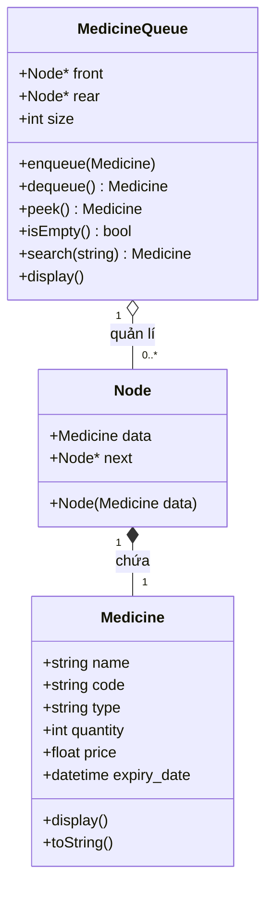

# Tổng quan về List và Queue trong Quản lý Kho Thuốc

## Sơ đồ ERD



## 1. Danh sách liên kết đơn (Single Linked List)

### Đặc điểm

- First In First Out (FIFO)
- Thêm vào cuối, lấy ra từ đầu
- Phù hợp quản lý theo thứ tự nhập xuất kho

### Các thao tác

- enqueue(): Thêm phần tử vào cuối O(1)
- dequeue(): Lấy phần tử đầu ra O(1)
- peek(): Xem phần tử đầu O(1)
- isEmpty(): Kiểm tra rỗng O(1)

### Quản lý theo FIFO

- Thuốc nhập trước xuất trước
- Tránh để thuốc tồn kho quá hạn
- Dễ dàng theo dõi số lượng và thứ tự

### Tối ưu bộ nhớ

- Cấp phát động linh hoạt
- Giải phóng bộ nhớ kịp thời
- Tránh memory leak

### Cấu trúc

```c
struct Node {
    Medicine data;
    struct Node* next;
};
```

## 2. Hàng đợi (Queue)

### Đặc điểm
- First In First Out (FIFO)
- Thêm vào cuối, lấy ra từ đầu
- Phù hợp quản lý theo thứ tự nhập xuất kho

### Các thao tác
- enqueue(): Thêm phần tử vào cuối O(1)
- dequeue(): Lấy phần tử đầu ra O(1) 
- peek(): Xem phần tử đầu O(1)
- isEmpty(): Kiểm tra rỗng O(1)

## 3. Ứng dụng trong Quản lý Kho

### Quản lý theo FIFO
- Thuốc nhập trước xuất trước
- Tránh để thuốc tồn kho quá hạn
- Dễ dàng theo dõi số lượng và thứ tự

### Tối ưu bộ nhớ
- Cấp phát động linh hoạt
- Giải phóng bộ nhớ kịp thời
- Tránh memory leak

## 4. So sánh với các Cấu trúc dữ liệu khác

### Array vs. Linked List

- Array: 
  - Ưu: Truy cập ngẫu nhiên nhanh O(1)
  - Nhược: Kích thước cố định, thêm/xóa chậm O(n)

- Linked List:
  - Ưu: Thêm/xóa nhanh O(1), kích thước linh động
  - Nhược: Truy cập ngẫu nhiên chậm O(n)

### Stack vs. Queue

- Stack (LIFO):
  - Phù hợp: Undo/Redo, Parser
  - Không phù hợp quản lý kho thuốc vì thuốc nhập sau sẽ xuất trước

- Queue (FIFO):
  - Phù hợp: Quản lý kho, xử lý giao dịch theo thứ tự
  - Đảm bảo thuốc không bị tồn kho quá lâu

## 5. Ví dụ Thực tế

### Tình huống 1: Nhập thuốc mới

Kho ban đầu:
```plaintext
[A]->[B]->[C]
```

Sau khi nhập thuốc D:
```plaintext
[A]->[B]->[C]->[D]
```

### Tình huống 2: Xuất thuốc

Kho ban đầu:
```plaintext
[A]->[B]->[C]->[D]
```

Sau khi xuất (FIFO):
```plaintext
[B]->[C]->[D]
```

### Tình huống 3: Tìm kiếm

Trạng thái kho:
```plaintext
[A]->[B]->[C]->[D]
```

Quá trình tìm C:
```plaintext
1. Duyệt A -> không phải
2. Duyệt B -> không phải
3. Duyệt C -> tìm thấy
Độ phức tạp: O(n)
```

## 6. Tips Triển khai

### Tối ưu hiệu năng

1. Sử dụng con trỏ `tail` để thêm vào cuối nhanh O(1)
2. Cập nhật `size` để biết số lượng thuốc không cần duyệt
3. Giải phóng bộ nhớ ngay khi xuất thuốc

### Xử lý các trường hợp đặc biệt

1. Queue rỗng:
   - Kiểm tra trước khi dequeue
   - Cập nhật front và rear là NULL

2. Queue có 1 phần tử:
   - Cẩn thận khi xóa phần tử cuối
   - front và rear phải trỏ đến NULL

3. Thêm vào queue rỗng:
   - front và rear phải trỏ đến node mới
   - Khởi tạo next là NULL
